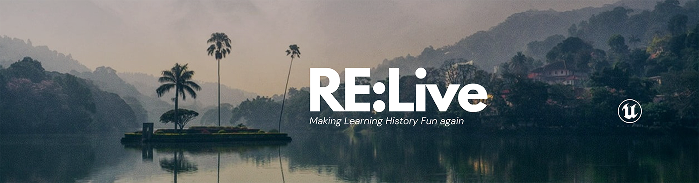

# Level Design Shamal



## Project Overview

This project, **Environment Creation**, is an Unreal Engine project focused on creating a visually immersive and interactive level. The goal is to design and develop a rich environment using Unreal Engine's tools and features to showcase level design, lighting, and environmental effects.

## Features

- **High-Quality Assets**: Includes custom-made or marketplace assets for realistic detailing.
- **Dynamic Lighting**: Advanced lighting setup to enhance mood and realism.
- **Interactive Elements**: Objects and features that players can interact with.
- **Post-Processing Effects**: Added depth and atmosphere with post-processing.
- **Optimized Performance**: Designed to run smoothly on various hardware setups.

### Prerequisites

- **Unreal Engine Version**: [5.5]
- A system meeting Unreal Engine's minimum requirements.

### Installation

1. Clone this repository or download it as a ZIP file.
   ```bash
   git clone https://github.com/Shamal56/Level-Design-Shamal.git
   ```
2. Open the project in Unreal Engine by double-clicking the `.uproject` file.

### Running the Level

1. Open Unreal Engine.
2. Navigate to `Content/Levels`.
3. Double-click the desired level to open it.
4. Click `Play` to explore the environment.

## Customization

You can modify the environment to fit your needs:

- **Lighting Settings**: Adjust the sun, shadows, or dynamic light sources.
- **Assets**: Replace existing assets with your own models and materials.
- **Post-Processing**: Edit the post-process volume for different visual effects.

## License

This project is licensed under the [MIT License](LICENSE).
